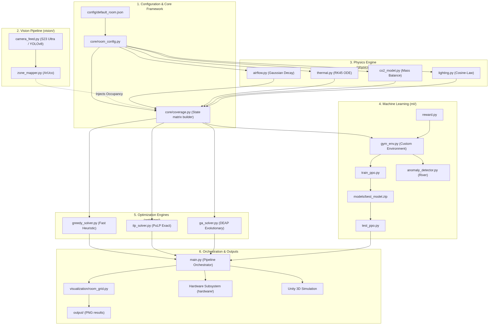
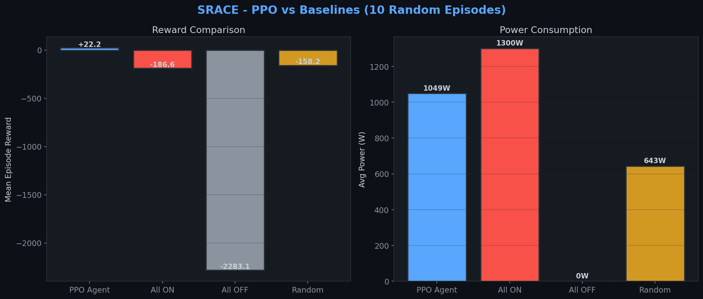
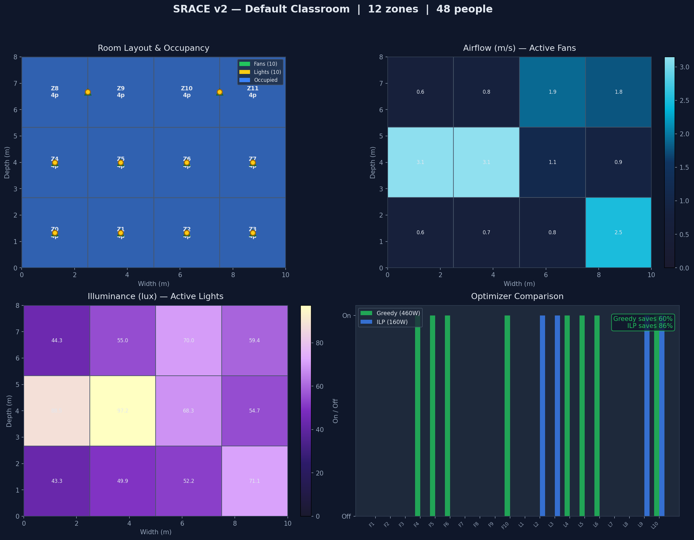
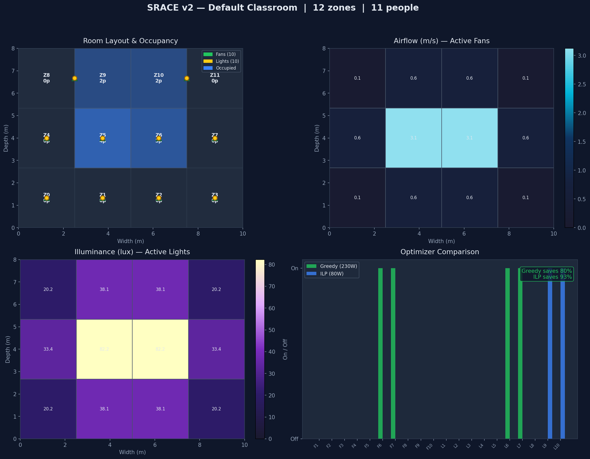

# SRACE v2: Smart Room Automation & Control Engine

> Generalised intelligent room automation platform that works for any room (classroom, office, staff room, auditorium) controlled via a single JSON config file. Not a fixed installation but a deployable system.



## The Problem
Institutional buildings waste 40% electricity running all fans and lights regardless of how many people are present or where they sit. Existing systems use dumb binary thresholds: everything on or everything off.

SRACE fixes this with real intelligence: physics-based models, mathematical optimization, and reinforcement learning to run only the appliances that matter.

## System Architecture

**Vision Pipeline:** S23 Ultra and Unity NavMesh Agents provide YOLOv8, ArUco, or Zone triggers to get zone counts every 5 seconds.

**Physics Engine (Python and C#):**
* Airflow: Gaussian decay
* Thermal: ODE solved with RK45 (Python) or RK4 (C#)
* CO2: Mass balance ODE (Python RK45 or C# RK4)
* Lighting: Cosine-law (inverse square)
* Output: Coverage matrix C[appliance][zone] (fans, lights, projectors)

**Optimizer Tier (3 solvers):**
* Greedy (real time, every 30s): 3-phase for fans, lights, projectors
* ILP via PuLP (exact optimal, every 60s)
* GA evolutionary (multi-objective, 80 generations)

**PPO RL Agent (Stable-Baselines3):**
* State: crowd, temps, CO2, lux, appliance states (incl. projectors)
* Action: which fans/lights/projectors to toggle
* Reward: penalize power, reward comfort, penalize switching, reward air quality, penalize danger, ensure stability

**Real-Time Communication:**
* MQTT bridge (paho-mqtt): pub/sub for RPi, Unity, dashboard
* FastAPI REST: 10+ endpoints (room_state, ppo_action, anomalies, mqtt_status)
* River anomaly detection: streaming ML for sensor drift alerts

**Four simultaneous outputs:**
* Unity 3D with Power HUD: fans, lights, projectors, temp/CO2 bars, zone heatmap
* Live HTML Dashboard: projector chips, anomaly alerts, MQTT status
* FastAPI Swagger UI: live data, power metrics, anomaly stats
* RPi LED Panel: MQTT-driven appliance state indicators

## Current Progress

* **Week 1: Python Core (Complete)**: Config loader, physics models, coverage matrix, Greedy and ILP optimizers, orchestrator, and Matplotlib visualization.
* **Week 2: Unity Simulation (Complete)**: Code-generated 3D room, animated fans and lights, zone heatmap, orbit camera, C# physics ports, and Live Power HUD.
* **Week 3: RL + Backend + Integration (Complete)**: Gymnasium environment, PPO pipeline, multi-objective reward function, FastAPI backend, Unity to Python bridge, GA optimizer, and Live HTML dashboard.
* **Week 4: Advanced Features (Complete)**: Projector appliance type, C# Thermal and CO2 ODE models, PPO environment updated for projectors, MQTT real-time bridge, River streaming anomaly detection, and PPO diagnostics toolkit.

## Visualizations

### PPO vs Baselines Performance


### Room Occupancy: Full Room Scenario


### Room Occupancy: Cluster Center Scenario


## Repository Structure

* `config/`: JSON configuration files for various room types (classroom, office, auditorium).
* `core/`: Room data models and coverage matrix builder.
* `physics/`: Python implementations of airflow, thermal, CO2, and lighting models.
* `optimizer/`: Solvers including Greedy, ILP, and Genetic Algorithm.
* `ml/`: Gymnasium environment, reward function, PPO training/testing, and anomaly detection.
* `backend/`: FastAPI application and MQTT bridge.
* `models/`: Saved models including the trained PPO agent.
* `Assets/SRACE/Scripts/`: Unity C# simulation scripts (Core, Environment, Physics).

## Mathematics and Physics

| Formula | Used For | Module |
|---------|----------|--------|
| `v(f,z) = v_peak * exp(-d^2/(2*sigma^2))`, sigma = radius/2 | Airflow per zone from each fan | `physics/airflow.py` |
| `dT/dt = -a*v*(T-T_target) + Q_occ/(rho*cp*V) + k*(T_amb-T)` | Temperature forecast (5 min, RK45) | `physics/thermal.py` |
| `dC/dt = (n*G)/(V) - lambda_vent*(C-C_ambient)` | CO2 per zone over time | `physics/co2_model.py` |
| `E = (Phi*cos^3(theta))/(2*pi*h^2)` | Lux per zone from each ceiling light | `physics/lighting.py` |
| `min sum(w_j * x_j) s.t. coverage >= 1 for all occupied zones` | Minimum power appliance subset | `optimizer/ilp_solver.py` |
| Fitness = coverage_fraction - alpha * power_fraction | GA multi-objective evolution | `optimizer/ga_solver.py` |

### PPO Reward Function

`R = -alpha*power + beta*comfort - gamma*switching + delta*air_quality - epsilon*danger`

* `alpha = 0.15` (power penalty, doubled for <30% occupancy)
* `beta = 0.55` (comfort: 40% temp + 30% CO2 + 15% coverage + 15% lux)
* `gamma = 0.05` (switching penalty)
* `delta = 0.15` (air quality bonus)
* `epsilon = 0.50` (danger penalty: >35C or >1200 ppm CO2)

Empty room: all off = +0.5, each active appliance = -0.5 penalty.

## Running the Project

### Prerequisites

```bash
python3 -m venv venv
source venv/bin/activate
pip install -r requirements.txt
```

### Python Pipeline
```bash
python3 main.py
```
Output: terminal results and visualizations in `./output/`.

### PPO Training and Evaluation
```bash
# Train PPO agent (quick test)
python3 ml/train_ppo.py --timesteps 1000

# Evaluate trained model
python3 ml/test_ppo.py --episodes 10 --render
```

### FastAPI Backend
```bash
source venv/bin/activate
uvicorn backend.api:app --reload --port 8000
```
Access Swagger UI at `http://localhost:8000/docs`.

### Live Dashboard
Start the API first, then open `dashboard.html` in any browser.

### Unity Simulation
1. Open the project in Unity (2022.3+ with URP).
2. Drag `default_room.json` into `Assets/SRACE/Resources/`.
3. Add `SRACEManager` to an empty GameObject.
4. Press Play.

## Test Scenarios

| Scenario | Occupancy | Expected Behavior |
|----------|-----------|-------------------|
| Empty Room | 0 people | All appliances OFF, 0W |
| Single Person | 1 in zone 0 | 1-2 fans + 1-2 lights near zone 0 |
| Center Cluster | 11 in zones 5,6,9,10 | Center fans + lights only |
| Full Room | 48 people (4/zone) | Most appliances ON, near max power |
| Front Row Only | 20 in zones 0-3 | Front-row appliances only, back OFF |

## Subject Mappings (Academic)
* **Computer Networks**: REST API, Unity to Python polling, JSON protocol.
* **Data Analysis & Algorithms**: Greedy O(n log n), ILP solver, GA evolutionary, coverage analysis.
* **Discrete Mathematics**: Weighted Set Cover (NP-hard), ILP binary variables, bipartite coverage graph.
* **AI and ML**: PPO RL agent, custom Gymnasium env, multi-objective reward shaping.

## Team Highlights

* **Generalised Design**: Works for any room via JSON config.
* **Multi-domain Expertise**: Combines CV, RL, combinatorics, physics, IoT, and distributed systems.
* **Triple Optimizer Approach**: Greedy for real-time, ILP for verification, and GA for multi-objective optimization.
